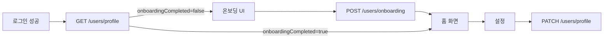

# Gistag 온보딩/프로필 API 앱 연동 가이드

이번 백엔드 작업으로 가입 직후 입력받는 사용자 기초 정보(성별·운동 종류·운동 주기)를 저장하고 조회/수정하는 API 3종이 추가되었습니다. 앱은 로그인 직후 1회 온보딩 화면을 띄우고, 이후에는 설정에서 동일한 값을 수정할 수 있습니다.

## 공통

모든 API는 JWT access token이 필요합니다.

```http
Authorization: Bearer <appAccessToken>
Content-Type: application/json
```

공통 에러는 NestJS 기본 에러 포맷을 따릅니다.

```json
{
  "statusCode": 401,
  "message": "Unauthorized",
  "error": "Unauthorized"
}
```

## 수집 정보 (코드 값)

DB·API에서 사용하는 코드 값은 모두 아래 표 기준입니다. 앱은 UI 라벨과 코드 값을 매핑해서 전송하세요.

### gender

| UI 라벨   | API 값        |
| --------- | ------------- |
| 남성      | `male`        |
| 여성      | `female`      |
| (예비)    | `other`       |
| (예비)    | `undisclosed` |

### exerciseTypes (복수 선택, 최소 1개)

| UI 라벨       | API 값         |
| ------------- | -------------- |
| 헬스          | `gym`          |
| 러닝          | `running`      |
| 요가/필라테스 | `yoga_pilates` |
| 수영          | `swimming`     |
| 기타          | `other`        |

- 배열로 전송합니다. 서버에서 중복은 자동으로 제거됩니다.
- 위 목록 외 값은 `400 Bad Request`로 거부됩니다.

### exerciseFrequency

| UI 라벨   | API 값         |
| --------- | -------------- |
| 매일      | `daily`        |
| 주 3~4회  | `3_4_per_week` |
| 주 1~2회  | `1_2_per_week` |
| 거의 안함 | `rarely`       |

## 사용자 앱 Flow



## 1. 프로필 조회

```http
GET /users/profile
```

로그인 직후 호출해서 온보딩 필요 여부를 판단합니다. 앱이 다시 켜질 때도 동일 응답으로 프로필 화면을 그릴 수 있습니다.

### Response 200, 온보딩 완료

```json
{
  "userId": "fd7a0364-1711-41b2-82a3-a0c1147db0ab",
  "nickname": "ikjun",
  "email": "ikjun@example.com",
  "providerType": "INFOTEAM",
  "onboardingCompleted": true,
  "profile": {
    "gender": "male",
    "exerciseTypes": ["gym", "running"],
    "exerciseFrequency": "3_4_per_week",
    "createdAt": "2026-05-28T08:01:57.634Z",
    "updatedAt": "2026-05-28T08:01:57.634Z"
  }
}
```

### Response 200, 온보딩 미완료

```json
{
  "userId": "fd7a0364-1711-41b2-82a3-a0c1147db0ab",
  "nickname": "ikjun",
  "email": "ikjun@example.com",
  "providerType": "INFOTEAM",
  "onboardingCompleted": false,
  "profile": null
}
```

앱은 `onboardingCompleted === false`이면 온보딩 플로우(성별 → 운동 종류 → 주기)를 띄우고, 마지막 단계에서 `POST /users/onboarding`을 호출합니다.

## 2. 온보딩 정보 최초 저장

```http
POST /users/onboarding
```

가입 후 1회만 호출합니다. UI는 단계별이지만 API는 3필드를 한 번에 전송합니다.

### Request

```json
{
  "gender": "male",
  "exerciseTypes": ["gym", "running"],
  "exerciseFrequency": "3_4_per_week"
}
```

- 3필드 모두 필수
- `exerciseTypes`는 최소 1개

### Response 201

`GET /users/profile`과 동일한 통합 응답을 반환합니다.

```json
{
  "userId": "fd7a0364-1711-41b2-82a3-a0c1147db0ab",
  "nickname": "ikjun",
  "email": "ikjun@example.com",
  "providerType": "INFOTEAM",
  "onboardingCompleted": true,
  "profile": {
    "gender": "male",
    "exerciseTypes": ["gym", "running"],
    "exerciseFrequency": "3_4_per_week",
    "createdAt": "2026-05-28T08:01:57.634Z",
    "updatedAt": "2026-05-28T08:01:57.634Z"
  }
}
```

### 주요 에러

- `400 Bad Request`: 누락 필드, 잘못된 enum 값, 빈 `exerciseTypes`
- `401 Unauthorized`: 토큰 없음/만료
- `409 Onboarding already completed`: 이미 온보딩이 완료된 사용자

`409`를 받으면 앱은 그대로 `GET /users/profile`로 동기화하고 온보딩 화면을 건너뛰면 됩니다.

## 3. 프로필 수정

```http
PATCH /users/profile
```

설정 화면에서 성별·운동 종류·운동 주기를 수정할 때 사용합니다. 보내는 필드만 업데이트됩니다.

### Request

3필드 모두 선택값이지만, **최소 1개**는 반드시 포함해야 합니다. `exerciseTypes`만 변경하는 예시는 다음과 같습니다.

```json
{
  "exerciseTypes": ["swimming", "yoga_pilates"]
}
```

### Response 200

업데이트가 반영된 통합 응답을 반환합니다.

```json
{
  "userId": "fd7a0364-1711-41b2-82a3-a0c1147db0ab",
  "nickname": "ikjun",
  "email": "ikjun@example.com",
  "providerType": "INFOTEAM",
  "onboardingCompleted": true,
  "profile": {
    "gender": "male",
    "exerciseTypes": ["swimming", "yoga_pilates"],
    "exerciseFrequency": "3_4_per_week",
    "createdAt": "2026-05-28T08:01:57.634Z",
    "updatedAt": "2026-05-28T08:01:57.666Z"
  }
}
```

### 주요 에러

- `400 At least one field is required`: 빈 바디 (`{}`)
- `400 Bad Request`: 잘못된 enum 값, 빈 `exerciseTypes`
- `401 Unauthorized`: 토큰 없음/만료
- `404 Onboarding not completed`: 아직 `POST /users/onboarding`을 하지 않은 사용자

`404`를 받으면 앱은 온보딩 플로우로 유도해야 합니다.

## 앱 연동 체크리스트

1. 로그인 성공 직후 `GET /users/profile`을 호출합니다.
2. `onboardingCompleted === false`이면 온보딩 플로우를 표시합니다.
3. 마지막 단계에서 `POST /users/onboarding`을 한 번에 호출합니다.
4. 응답을 그대로 사용자 상태(store)에 저장해도 됩니다. (`GET /users/profile`과 동일 스키마)
5. 설정 화면에서 수정 시 `PATCH /users/profile`로 변경된 필드만 보냅니다.
6. `409` (이미 완료) / `404` (미완료)는 앱이 흐름을 보정할 신호로 활용합니다.
