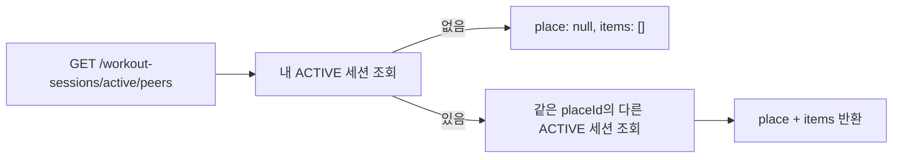

# Gistag 랭킹 / 같은 장소 운동 중 사용자 API 앱 연동 가이드

전체 누적 XP 기준 랭킹과, 현재 내가 운동 중인 장소에서 함께 운동 중인 다른 사용자 목록을 조회하는 API 2종이 추가되었습니다.

## 공통

모든 API는 JWT access token이 필요합니다.

```http
Authorization: Bearer <appAccessToken>
Content-Type: application/json
```

공통 에러는 NestJS 기본 에러 포맷을 따릅니다.

```json
{
  "statusCode": 401,
  "message": "Unauthorized",
  "error": "Unauthorized"
}
```

## 1. 전체 누적 XP 랭킹 조회

```http
GET /rankings
```

전체 사용자 중 `user_stats.total_xp` 기준 순위를 조회합니다. 페이지에 포함되지 않아도 **본인 순위(`me`)는 항상** 반환됩니다.

### Query Parameters

| 파라미터 | 타입   | 기본값 | 설명                          |
| -------- | ------ | ------ | ----------------------------- |
| `limit`  | number | 20     | 1~100, 한 페이지 항목 수      |
| `offset` | number | 0      | 0 이상, 페이지 시작 위치      |

### 정렬 규칙

- `totalXp DESC`, 동점 시 `userId ASC`
- 아직 운동을 완료하지 않아 `user_stats` 행이 없는 사용자는 랭킹 대상에서 제외됩니다.

### Response 200

```json
{
  "items": [
    {
      "rank": 1,
      "userId": "fd7a0364-1711-41b2-82a3-a0c1147db0ab",
      "nickname": "alice",
      "level": 5,
      "totalXp": 1480,
      "currentStreak": 7
    }
  ],
  "me": {
    "rank": 42,
    "userId": "9b8c3a3e-6e10-4d77-8a2a-9f1b6a3a92cd",
    "nickname": "ikjun",
    "level": 2,
    "totalXp": 380,
    "currentStreak": 1
  },
  "total": 128
}
```

### 필드 설명

| 필드            | 설명                                              |
| --------------- | ------------------------------------------------- |
| `items`         | 현재 페이지의 랭킹 목록                           |
| `me`            | 본인 순위. `user_stats`가 없으면 `null`           |
| `total`         | 랭킹 대상 전체 사용자 수 (`user_stats` 행 수)     |
| `currentStreak` | DB `streak_days` 값                               |

### 주요 에러

- `400 Bad Request`: 잘못된 `limit` / `offset`
- `401 Unauthorized`: 토큰 없음/만료

## 2. 같은 장소 운동 중인 다른 사용자 조회

```http
GET /workout-sessions/active/peers
```

내 **ACTIVE** 운동 세션이 있는 장소(`placeId`)를 기준으로, 같은 장소에서 현재 운동 중인 **다른 사용자**의 ACTIVE 세션 목록을 반환합니다.

### 동작



- 본인은 `items`에 포함되지 않습니다.
- 내 ACTIVE 세션이 없으면 `200` + `{ "place": null, "items": [] }`를 반환합니다.
- `durationSeconds`는 서버 시간 기준 `(now - sessionStartedAt)` 초입니다.

### Response 200, ACTIVE 세션 있음

```json
{
  "place": {
    "id": 1,
    "name": "GIST 체육관",
    "category": "gym"
  },
  "items": [
    {
      "userId": "fd7a0364-1711-41b2-82a3-a0c1147db0ab",
      "nickname": "bob",
      "level": 3,
      "totalXp": 720,
      "currentStreak": 4,
      "sessionStartedAt": "2026-05-31T10:31:00.000Z",
      "durationSeconds": 1740
    }
  ]
}
```

### Response 200, ACTIVE 세션 없음

```json
{
  "place": null,
  "items": []
}
```

### 필드 설명

| 필드               | 설명                                      |
| ------------------ | ----------------------------------------- |
| `place`            | 내 ACTIVE 세션의 장소 정보                |
| `items`            | 같은 장소에서 운동 중인 다른 사용자 목록  |
| `sessionStartedAt` | 해당 사용자의 ACTIVE 세션 시작 시각       |
| `durationSeconds`  | 세션 시작 후 경과 시간(초), 서버 기준      |

### 주요 에러

- `401 Unauthorized`: 토큰 없음/만료

## 앱 연동 체크리스트

1. 랭킹 화면 진입 시 `GET /rankings?limit=20&offset=0` 호출
2. `me` 필드로 본인 순위를 상단/하단에 별도 표시
3. `total`과 `offset`/`limit`으로 페이지네이션 구현
4. 운동 중 화면에서 주기적으로 `GET /workout-sessions/active/peers` 폴링
5. `place === null`이면 "현재 운동 중인 장소 없음" UI 처리
6. `items`가 비어 있으면 "지금은 혼자 운동 중" UI 처리
