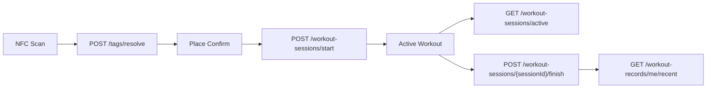

# Gistag 운동/NFC API 앱 연동 가이드

이번 백엔드 작업으로 NFC 태그 검증, 운동 세션 시작/복구/종료, 최근 운동 기록 조회 API가 추가되었습니다. 앱에서는 NFC 스티커에서 읽은 `tagCode`를 서버에 전달하고, 서버가 장소 검증과 운동 시간/XP/streak 계산을 담당합니다.

## 공통

모든 API는 JWT access token이 필요합니다.

```http
Authorization: Bearer <appAccessToken>
Content-Type: application/json
```

공통 에러는 NestJS 기본 에러 포맷을 따릅니다.

```json
{
  "statusCode": 401,
  "message": "Invalid or expired access token",
  "error": "Unauthorized"
}
```

## NFC 스티커 읽기 방식

앱은 NFC 스티커의 하드웨어 UID를 주 식별자로 사용하지 않습니다. Android에서는 UID를 읽을 수 있지만 iOS 호환성과 복제 가능성 때문에 신뢰 식별자로 쓰기 어렵습니다.

스티커에는 앱 전용 NDEF payload가 기록됩니다.

```text
gistag://tag/GISTAG_TAG_DEMO_001
```

앱은 payload에서 `tagCode`만 파싱해 서버로 보냅니다.

```json
{
  "tagCode": "GISTAG_TAG_DEMO_001"
}
```

`hardwareUid`를 읽을 수 있는 경우 선택적으로 함께 보낼 수 있지만, MVP 판단 기준은 `tagCode`입니다.

## 사용자 앱 Flow



## 1. 태그 검증

```http
POST /tags/resolve
```

NFC payload에서 읽은 `tagCode`가 유효한 장소에 연결되어 있는지 확인합니다.

### Request

```json
{
  "tagCode": "GISTAG_TAG_DEMO_001",
  "hardwareUid": "04:A1:B2:C3:D4:E5:F6"
}
```

`hardwareUid`는 선택값입니다.

### Response 200

```json
{
  "tag": {
    "id": 1,
    "code": "GISTAG_TAG_DEMO_001",
    "status": "ACTIVE"
  },
  "place": {
    "id": 1,
    "name": "제2학생회관 헬스장",
    "description": "캠퍼스 내 헬스장",
    "category": "gym",
    "imageUrl": null
  },
  "canStartWorkout": true,
  "blockedReason": null
}
```

### 주요 에러

- `404 Tag not found`: 등록되지 않은 태그
- `422 Tag is inactive`: 비활성 또는 폐기된 태그
- `422 Tag is not assigned to a place`: 아직 장소에 연결되지 않은 태그

## 2. 진행 중인 운동 조회

```http
GET /workout-sessions/active
```

앱 재실행, background 복귀, 홈 진입 시 진행 중인 세션을 복구할 때 사용합니다.

### Response 200, 세션 있음

```json
{
  "session": {
    "id": "6e6f2772-65f5-40c7-b58f-9c7de570c9ff",
    "status": "ACTIVE",
    "startedAt": "2026-05-26T09:12:30.000Z",
    "place": {
      "id": 1,
      "name": "제2학생회관 헬스장",
      "category": "gym"
    },
    "startedByTag": {
      "id": 1,
      "code": "GISTAG_TAG_DEMO_001"
    }
  }
}
```

### Response 200, 세션 없음

```json
{
  "session": null
}
```

## 3. 운동 시작

```http
POST /workout-sessions/start
```

태그 검증 화면에서 사용자가 시작 버튼을 누를 때 호출합니다. 앱이 보낸 `placeId`와 서버의 `tagCode -> placeId` 매핑이 다시 검증됩니다.

### Request

```json
{
  "tagCode": "GISTAG_TAG_DEMO_001",
  "placeId": 1
}
```

### Response 201

```json
{
  "session": {
    "id": "6e6f2772-65f5-40c7-b58f-9c7de570c9ff",
    "status": "ACTIVE",
    "startedAt": "2026-05-26T09:12:30.000Z",
    "place": {
      "id": 1,
      "name": "제2학생회관 헬스장",
      "category": "gym"
    }
  }
}
```

### 주요 에러

- `404 Tag not found`: 태그 없음
- `409 Active workout session already exists`: 이미 진행 중인 운동 있음
- `422 Tag is inactive`: 태그가 활성 상태가 아님
- `422 Tag does not belong to place`: 앱이 확인한 장소와 태그의 실제 장소가 다름

`409`를 받으면 앱은 `GET /workout-sessions/active`로 기존 세션을 복구하면 됩니다.

## 4. 운동 종료

```http
POST /workout-sessions/{sessionId}/finish
```

운동 종료 버튼을 누를 때 호출합니다. 최종 `finishedAt`, `durationSeconds`, `earnedXp`, streak 갱신은 서버 기준으로 계산됩니다.

### Request

```json
{
  "clientFinishedAt": "2026-05-26T09:42:30.000Z"
}
```

`clientFinishedAt`은 참고용입니다. 서버 계산에는 사용하지 않습니다.

### Response 200

```json
{
  "record": {
    "id": "2a89d38f-c8e6-49af-b815-3e670a6f7bd8",
    "sessionId": "6e6f2772-65f5-40c7-b58f-9c7de570c9ff",
    "place": {
      "id": 1,
      "name": "제2학생회관 헬스장",
      "category": "gym"
    },
    "startedAt": "2026-05-26T09:12:30.000Z",
    "finishedAt": "2026-05-26T09:42:30.000Z",
    "durationSeconds": 1800,
    "earnedXp": 120
  },
  "reward": {
    "earnedXp": 120,
    "totalXp": 940,
    "level": 3,
    "streakDays": 5,
    "streakUpdated": true
  }
}
```

이미 종료된 세션에 대한 재요청은 가능한 경우 기존 record를 반환합니다.

```json
{
  "record": {
    "id": "2a89d38f-c8e6-49af-b815-3e670a6f7bd8",
    "sessionId": "6e6f2772-65f5-40c7-b58f-9c7de570c9ff",
    "place": {
      "id": 1,
      "name": "제2학생회관 헬스장",
      "category": "gym"
    },
    "startedAt": "2026-05-26T09:12:30.000Z",
    "finishedAt": "2026-05-26T09:42:30.000Z",
    "durationSeconds": 1800,
    "earnedXp": 120
  },
  "reward": {
    "earnedXp": 120,
    "totalXp": 940,
    "level": 3,
    "streakDays": 5,
    "streakUpdated": false
  },
  "alreadyFinished": true
}
```

### 주요 에러

- `404 Workout session not found`: 세션이 없거나 내 세션이 아님
- `409 Workout session already cancelled`: 이미 취소된 세션
- `409 Workout session already finished`: 종료 상태지만 record를 찾을 수 없는 비정상 상태
- `422 Workout duration is too short`: 최소 운동 시간 미만

현재 최소 운동 시간은 60초입니다.

## 5. 운동 취소

```http
POST /workout-sessions/{sessionId}/cancel
```

실수로 운동을 시작했거나 기록으로 남기지 않을 때 사용합니다. 취소된 세션은 운동 기록으로 저장되지 않습니다.

### Request

```json
{
  "reason": "USER_CANCELLED"
}
```

`reason`은 선택값입니다.

### Response 200

```json
{
  "ok": true
}
```

## 6. 최근 운동 기록

```http
GET /workout-records/me/recent?limit=5
```

홈 화면 최근 기록 카드용 API입니다.

### Query

- `limit`: 선택값, 기본 5, 최대 20

### Response 200

```json
{
  "items": [
    {
      "id": "2a89d38f-c8e6-49af-b815-3e670a6f7bd8",
      "placeName": "제2학생회관 헬스장",
      "startedAt": "2026-05-26T09:12:30.000Z",
      "durationSeconds": 1800,
      "earnedXp": 120
    }
  ]
}
```

## 운영자용 NFC 관리 API

아래 API는 NFC 스티커 발급/등록/관리용입니다. 현재는 JWT 인증만 적용되어 있고, 별도 admin role guard는 아직 없습니다.

### NFC tagCode 발급

```http
POST /nfc/issue
```

```json
{
  "tagId": 1,
  "tagCode": "GISTAG_TAG_123ABC",
  "ndefPayload": "gistag://tag/GISTAG_TAG_123ABC",
  "ndefType": "URI"
}
```

운영 앱은 응답의 `ndefPayload`를 실제 NFC 스티커에 기록합니다.

### NFC 스티커 등록

```http
POST /nfc/register
```

```json
{
  "tagCode": "GISTAG_TAG_123ABC",
  "placeId": 1,
  "hardwareUid": "04:A1:B2:C3:D4:E5:F6",
  "ndefPayload": "gistag://tag/GISTAG_TAG_123ABC",
  "ndefType": "URI",
  "techTypes": ["NFC_A", "NDEF"],
  "isWritable": true,
  "maxSizeBytes": 144
}
```

`placeId`가 있으면 `ACTIVE`, 없으면 `UNASSIGNED` 상태로 저장됩니다.

### NFC 스티커 장소 연결

```http
PATCH /nfc/{tagId}/place
```

```json
{
  "placeId": 1
}
```

성공 시 태그는 `ACTIVE` 상태가 됩니다.

### NFC 스티커 상태 변경

```http
PATCH /nfc/{tagId}/status
```

```json
{
  "status": "INACTIVE"
}
```

허용 상태는 `UNASSIGNED`, `ACTIVE`, `INACTIVE`, `RETIRED`입니다. `ACTIVE`로 전환하려면 `placeId`가 먼저 연결되어 있어야 합니다.

## 앱 연동 체크리스트

1. NFC 스캔 결과에서 `gistag://tag/<tagCode>` 형태의 NDEF payload를 파싱합니다.
2. `POST /tags/resolve`로 장소를 검증합니다.
3. 성공 시 장소 확인 화면을 보여주고, 시작 버튼에서 `POST /workout-sessions/start`를 호출합니다.
4. 운동 화면에서는 로컬 타이머를 보여주되, 최종 시간은 서버 응답을 사용합니다.
5. 앱 재시작/background 복귀 시 `GET /workout-sessions/active`로 세션을 복구합니다.
6. 종료 버튼에서 `POST /workout-sessions/{sessionId}/finish`를 호출하고 결과 화면은 `record`와 `reward` 응답으로 구성합니다.
7. 홈 최근 기록 카드는 `GET /workout-records/me/recent?limit=5`를 사용합니다.
