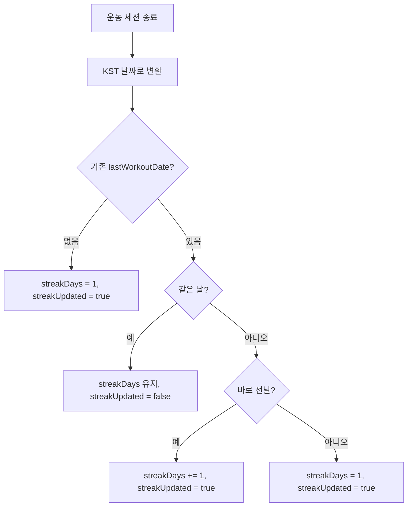
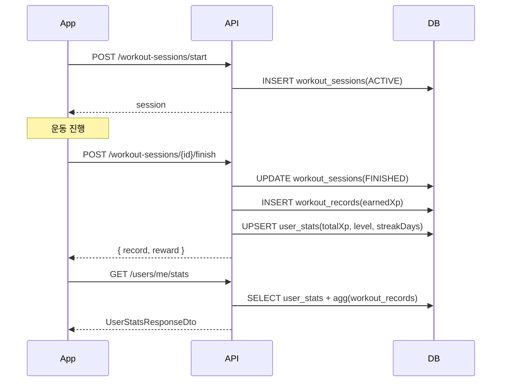

# Gistag XP / Level / Streak 시스템 가이드

운동 세션 종료 시 자동으로 누적되는 사용자 스탯(XP, 레벨, 스트릭) 시스템과 관련된 모든 API, 계산 규칙, 앱 연동 시 주의 사항을 한 곳에 정리합니다.

## 1. 핵심 개념

| 개념             | 설명                                                                                | 저장 위치                          |
| ---------------- | ----------------------------------------------------------------------------------- | ---------------------------------- |
| `earnedXp`       | 단일 운동 세션에서 획득한 XP                                                        | `workout_records.earned_xp`        |
| `totalXp`        | 사용자 누적 XP                                                                      | `user_stats.total_xp`              |
| `level`          | 누적 XP로 결정되는 정수 레벨 (1부터 시작)                                           | `user_stats.level`                 |
| `streakDays`     | 연속 운동 일수 (KST 자정 기준)                                                      | `user_stats.streak_days`           |
| `lastWorkoutDate`| 마지막 운동 KST 날짜 (`YYYY-MM-DD`)                                                 | `user_stats.last_workout_date`     |

## 2. 계산 공식

상수는 `src/workout-sessions/workout-sessions.service.ts`와 `src/users/users.service.ts`에 동일하게 정의되어 있습니다.

| 상수                       | 값  | 의미                                |
| -------------------------- | --- | ----------------------------------- |
| `MINIMUM_DURATION_SECONDS` | 60  | 최소 운동 시간(초). 미만이면 종료 거부 |
| `XP_PER_MINUTE`            | 4   | 1분당 획득 XP                       |
| `XP_PER_LEVEL`             | 300 | 레벨업에 필요한 XP                  |

### 2.1 earnedXp (세션별)

```ts
earnedXp = floor(durationSeconds / 60) * XP_PER_MINUTE;
// MVP에서는 floor((durationSeconds / 60) * 4)
```

### 2.2 totalXp / level

```ts
totalXp = previousTotalXp + earnedXp;
level = floor(totalXp / 300) + 1;
// xpInCurrentLevel = totalXp % 300
// xpToNextLevel    = 300 - (totalXp % 300)
```

| totalXp | level | xpInCurrentLevel | xpToNextLevel |
| ------- | ----- | ---------------- | ------------- |
| 0       | 1     | 0                | 300           |
| 240     | 1     | 240              | 60            |
| 300     | 2     | 0                | 300           |
| 940     | 4     | 40               | 260           |

### 2.3 streakDays (KST 기준)

운동 종료 시점을 KST(UTC+9)로 변환해 `YYYY-MM-DD` 형태로 비교합니다.



요약:

- 첫 운동 → `1`
- 같은 KST 날짜에 다시 종료 → 그대로
- 직전 날(어제)에 운동 후 오늘 종료 → `+1`
- 그 외(공백 발생) → `1`로 리셋

## 3. 갱신 시점

XP/level/streak는 **운동 세션 종료 시점**에만 갱신됩니다. 호출되는 API:

```http
POST /workout-sessions/{sessionId}/finish
```

조건:

1. 세션이 `ACTIVE` 상태여야 합니다.
2. `durationSeconds >= 60`이어야 합니다 (미만은 `422`).
3. 트랜잭션 안에서 `workout_sessions` → `workout_records` → `user_stats` 순으로 업데이트됩니다.

이미 `FINISHED`인 세션을 다시 호출하면 `alreadyFinished: true`로 동일 응답을 반환하며, 추가 적립은 되지 않습니다.

## 4. 관련 API

모든 API는 JWT가 필요합니다.

```http
Authorization: Bearer <appAccessToken>
Content-Type: application/json
```

### 4.1 운동 종료 — XP/level/streak 갱신

```http
POST /workout-sessions/{sessionId}/finish
```

자세한 요청/응답은 [`docs/workout-api-app-integration.md`](workout-api-app-integration.md) 참고. 응답의 `reward` 필드가 핵심입니다.

```json
{
  "record": {
    "id": "...",
    "sessionId": "...",
    "place": { "id": 1, "name": "GIST 체육관", "category": "gym" },
    "startedAt": "2026-05-31T10:00:00.000Z",
    "finishedAt": "2026-05-31T10:30:00.000Z",
    "durationSeconds": 1800,
    "earnedXp": 120
  },
  "reward": {
    "earnedXp": 120,
    "totalXp": 940,
    "level": 4,
    "streakDays": 5,
    "streakUpdated": true
  }
}
```

- `streakUpdated: true` → 결과 화면에서 "🔥 streak +1!" 같은 강조를 권장
- `streakUpdated: false` → 같은 날 두 번째 종료. 스트릭 변동 없음

### 4.2 내 누적 스탯 조회 (NEW)

```http
GET /users/me/stats
```

홈/마이 페이지에서 운동 없이 현재 스탯만 보고 싶을 때 사용합니다. `user_stats` 행이 없는 신규 사용자는 모든 수치가 기본값(레벨 1, XP 0, streak 0)으로 반환됩니다.

#### Response 200, 운동 이력 있음

```json
{
  "userId": "fd7a0364-1711-41b2-82a3-a0c1147db0ab",
  "level": 4,
  "totalXp": 940,
  "xpInCurrentLevel": 40,
  "xpToNextLevel": 260,
  "xpPerLevel": 300,
  "currentStreak": 5,
  "lastWorkoutDate": "2026-05-31",
  "totalWorkouts": 12,
  "totalDurationSeconds": 21600
}
```

#### Response 200, 신규 사용자 (운동 이력 없음)

```json
{
  "userId": "fd7a0364-1711-41b2-82a3-a0c1147db0ab",
  "level": 1,
  "totalXp": 0,
  "xpInCurrentLevel": 0,
  "xpToNextLevel": 300,
  "xpPerLevel": 300,
  "currentStreak": 0,
  "lastWorkoutDate": null,
  "totalWorkouts": 0,
  "totalDurationSeconds": 0
}
```

#### 필드 설명

| 필드                   | 타입            | 설명                                                  |
| ---------------------- | --------------- | ----------------------------------------------------- |
| `userId`               | string (uuid)   | 사용자 ID                                             |
| `level`                | number          | 현재 레벨 (1부터)                                     |
| `totalXp`              | number          | 누적 XP                                               |
| `xpInCurrentLevel`     | number          | `totalXp % 300`                                       |
| `xpToNextLevel`        | number          | `300 - (totalXp % 300)`                               |
| `xpPerLevel`           | number          | 레벨업 임계 XP (현재 300, 추후 변경 가능)             |
| `currentStreak`        | number          | 연속 운동 일수                                        |
| `lastWorkoutDate`      | string \| null  | 마지막 운동 KST 날짜 (`YYYY-MM-DD`)                   |
| `totalWorkouts`        | number          | 완료된 운동 세션 개수                                 |
| `totalDurationSeconds` | number          | 누적 운동 시간(초)                                    |

#### 주요 에러

- `401 Unauthorized`: 토큰 없음/만료

### 4.3 전체 누적 XP 랭킹

```http
GET /rankings?limit=20&offset=0
```

응답의 `me`는 본인의 `level`, `totalXp`, `currentStreak`을 포함합니다. 자세한 내용은 [`docs/rankings-and-place-peers-api.md`](rankings-and-place-peers-api.md) 참고.

### 4.4 같은 장소 ACTIVE 사용자

```http
GET /workout-sessions/active/peers
```

각 peer 항목에 `level`, `totalXp`, `currentStreak`이 포함됩니다. 자세한 내용은 [`docs/rankings-and-place-peers-api.md`](rankings-and-place-peers-api.md) 참고.

### 4.5 최근 운동 기록 (세션별 earnedXp)

```http
GET /workout-records/me/recent?limit=5
```

각 항목에 `earnedXp`만 포함됩니다 (누적 스탯 없음). 자세한 내용은 [`docs/workout-api-app-integration.md`](workout-api-app-integration.md) 참고.

## 5. 앱에서 자주 쓰는 시나리오

### 5.1 홈 화면 — 스탯 헤더

1. 진입 시 `GET /users/me/stats` 호출
2. `level`, `totalXp / xpPerLevel` 진행률 바, `currentStreak` 표시
3. `lastWorkoutDate === today(KST)`면 "오늘 운동 완료" UI

### 5.2 운동 결과 화면 — 보상 연출

1. `POST /workout-sessions/{id}/finish` 응답의 `reward` 사용
2. `streakUpdated`로 streak 애니메이션 분기
3. `level`이 이전 값보다 커졌으면 "레벨업!" 모달 (이전 값은 앱 캐시 또는 finish 호출 직전 `GET /users/me/stats`로 비교)

### 5.3 랭킹 / 친구 비교 화면

- 페이지 데이터: `GET /rankings`
- 같은 장소: `GET /workout-sessions/active/peers`

### 5.4 운동 흐름 통합 다이어그램



## 6. 비범위 (의도적으로 안 하는 것)

- 시즌별 XP, 주간/월간 XP 랭킹
- 레벨별 다른 XP 임계 (현재는 모든 레벨이 300 XP)
- 친구/그룹 단위 streak
- 운동 종류별 XP 가중치
- streak 회복(freeze) 아이템

## 7. 변경 이력

| 일자        | 변경 내용                                                                 |
| ----------- | ------------------------------------------------------------------------- |
| 2026-05-28  | XP/level/streak 적립 로직 도입 (`workout-sessions` finish 트랜잭션)       |
| 2026-05-31  | `GET /rankings`, `GET /workout-sessions/active/peers` 추가                |
| 2026-05-31  | `GET /users/me/stats` 추가, 본 문서 신규 작성                             |
